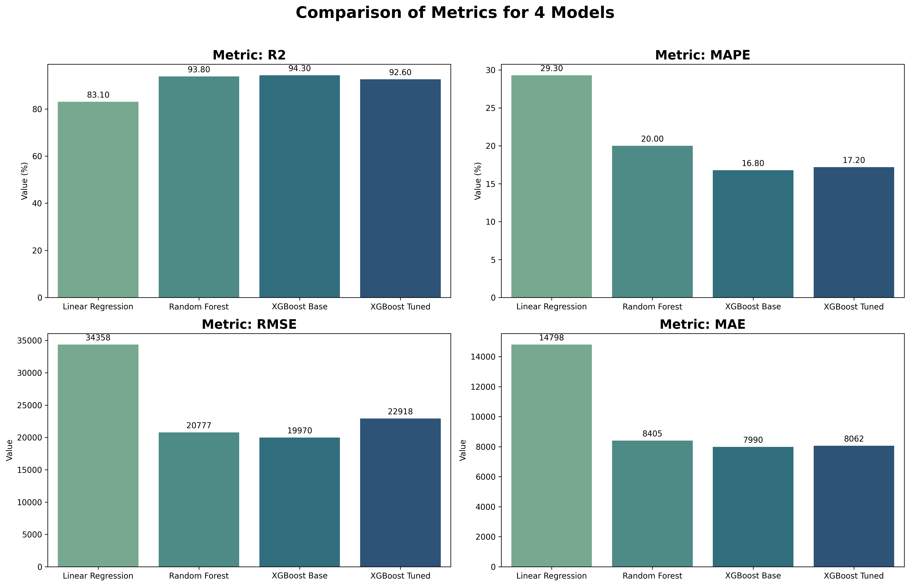

# 🚗 Car Price Prediction in Poland


## 📌 Project Overview

The objective of this project is to design and deploy a production-ready machine learning pricing engine for the Polish secondary automotive market.

The system leverages structured vehicle metadata — including temporal depreciation patterns, power-to-weight characteristics, equipment configurations and brand-level market segmentation — to model real-world supply-demand dynamics and generate high-precision, market-aligned price estimates.

Beyond point prediction, the solution is engineered to support pricing risk reduction, margin optimization and data-driven inventory decisions, enabling car dealers and individual sellers to objectively position their offers within the competitive Polish used-car ecosystem.

The project evolved through four distinct modeling stages: **Linear Regression**, **Random Forest**, **Base XGBoost**, and a **Final Tuned XGBoost** (optimized with Optuna and refined data scope).

After extensive data preprocessing, Exploratory Data Analysis (EDA), and feature engineering, the final model achieved production-grade performance, significantly outperforming baseline approaches.

---

## 🚀 Live Demo & Models

### 🖥️ Streamlit Dashboard
Explore the interactive application to predict car prices in real-time:
**[Launch App](https://cars-price-prediction-in-poland-93x3kme8tvdopec5f4vxul.streamlit.app/)**

### 🤗 Hugging Face Model Registry
Due to file size constraints, the trained models are hosted on the Hugging Face Hub:
**[View Models on Hugging Face](https://huggingface.co/Przemsonn/poland-car-price-model)**

---

## 📊 Model Performance & Evolution

A strategic decision was made to refine the scope of the final model by filtering out vintage cars (pre-1980) and ultra-luxury supercars (top 1% price quantile). This shifted the focus to the **mass consumer market**, resulting in drastically improved accuracy.

### 📉 Metric Comparison
The following chart illustrates the progressive reduction in error rates across model iterations.



| Model Version | Description | R² Score | RMSE (PLN) | MAE (PLN) | MAPE (%) |
| :--- | :--- | :--- | :--- | :--- | :--- |
| **Model 1** | Linear Regression (Baseline) | 89.78% | 26,547 | 9,597 | 19.30% |
| **Model 2** | Random Forest | 92.14% | 23,273 | 8,333 | 18.95% |
| **Model 3** | XGBoost (Base) | 92.24% | 23,124 | 7,655 | 15.90% |
| **Model 4** | **XGBoost (Tuned & Cleaned)** | **94.32%** | **14,150** | **6,838** | **15.84%** |

### 📈 Quantified Performance Uplift
The optimization pipeline delivered a statistically significant improvement in predictive fidelity, validating the strategic decision to refine the market scope:

* **Risk Mitigation (RMSE):** Achieved a **46.7% reduction** in residual error magnitude relative to the baseline ($\Delta$ -12,397 PLN). This drastic tightening of the error distribution indicates the model has successfully minimized bias while maintaining low variance.

* **Variance Explanation ($R^2$):** Boosted the Coefficient of Determination to **0.943**, capturing over **94%** of the underlying market volatility. This confirms the model's ability to encode complex, non-linear feature interactions (e.g., *Power-to-Weight* ratios) that simpler linear models missed.

---

## 💡 Business Impact & ROI

From a commercial standpoint, the evolution from Model 1 to Model 4 delivers tangible value drivers:

1.  **High-Velocity Segment Optimization:**
    By consciously excluding hyper-niche outliers (vintage collectibles and supercars), the model achieves specialized precision for the **99% of vehicles that drive market liquidity**. This strategic tradeoff sacrifices the "long tail" to maximize predictive power for high-volume movers (e.g., VW Golf, Toyota Corolla), ensuring the tool is optimized for the bulk of real-world transactions.

2.  **Capital Efficiency & Risk Mitigation:**
    Reducing the RMSE from ~26k PLN to ~14k PLN is not just a statistical win—it cuts **valuation uncertainty by 46%**. For an automotive dealership or leasing firm, this directly minimizes financial exposure, preventing capital lock-up in overpriced inventory and reducing write-offs on undervalued assets.

3.  **Competitive Yield Management:**
    With a Mean Absolute Percentage Error (MAPE) of ~15%, the model provides a **data-driven pricing floor**. This enables sellers to implement dynamic pricing strategies—setting aggressive yet profitable prices without eroding margins due to estimation variance.

---

## 🧠 Key Learnings

This project served as a rigorous exercise in end-to-end ML engineering. Key takeaways include:

* **The "Clean Data" Multiplier:** Advanced algorithms cannot compensate for noisy data. The most significant performance leap (Model 3 $\to$ Model 4) came not from model complexity, but from domain-aware data cleaning (removing non-representative outliers).
* **Leakage Prevention:** Implementing a custom Scikit-Learn transformer (`GroupedImputer`) was critical. Naively imputing missing values using the full dataset's mean would have introduced data leakage, inflating test scores and failing in production.
* **Bayesian vs. Grid Search:** Using Optuna (Bayesian optimization) proved far superior to traditional Grid Search. It allowed for efficient exploration of the XGBoost hyperparameter space, converging on optimal settings with significantly lower computational cost.

---

## 🔮 Future Roadmap

To further enhance the system's predictive power and usability, the following improvements are planned:

* [ ] **NLP Integration (Hugging Face):** Extract semantic features from unstructured text descriptions using Polish BERT models to capture condition nuances not reflected in tabular data.
* [ ] **Dockerization:** Containerize the application to ensure complete environment reproducibility and simplify deployment to cloud platforms (AWS/Azure).
* [ ] **Automated CI/CD Pipeline:** Implement GitHub Actions to automate testing and model retraining when new data becomes available.
* [ ] **Ensemble Stacking:** Experiment with stacking the XGBoost model with a LightGBM or CatBoost regressor to squeeze out final percentage points of accuracy.

---

## ⚙️ Technical Architecture

### 1. Advanced Feature Engineering
Domain knowledge was applied to extract high-value signals from raw data:
* **`Power_per_liter`**: A ratio indicating engine efficiency and performance density.
* **`Vehicle_age`**: Calculated dynamically relative to the advertisement publication date.
* **`Is_premium`**: A categorical flag for luxury brands based on market segmentation.
* **`Annual_mileage`**: Derived to detect excessive wear (high mileage) or "garage queens" (suspiciously low mileage).

### 2. External API Integration
The system integrates with the **National Bank of Poland (NBP) REST API** to fetch real-time EUR/PLN exchange rates. This ensures that dataset entries listed in EUR are normalized to PLN based on accurate market data, preventing currency fluctuation noise.

### 3. Hyperparameter Optimization (Optuna)
Instead of a brute-force GridSearch, the project utilizes **Optuna** with the Tree-structured Parzen Estimator (TPE) sampler. This allowed for efficient navigation of the XGBoost hyperparameter space (learning rate, depth, regularization), converging on optimal settings with fewer computational resources.

---

## 🛠 Tech Stack

* **Language:** Python 3.9+
* **Core Libraries:** Pandas, NumPy, Scikit-Learn
* **Modeling:** XGBoost (Gradient Boosting)
* **Optimization:** Optuna
* **Visualization:** Matplotlib, Seaborn
* **Utilities:** Joblib (Serialization), Requests (API)

---

## 📥 Installation & Usage

1.  **Clone the repository:**
    ```bash
    git clone [https://github.com/YourUsername/Car-Price-Prediction.git](https://github.com/YourUsername/Car-Price-Prediction.git)
    ```

2.  **Install dependencies:**
    ```bash
    pip install -r requirements.txt
    ```

3.  **Run the main script:**
    ```bash
    python main.py
    ```

4.  **Launch the Streamlit App:**
    ```bash
    streamlit run app.py
    ```