# 🚗 Car Price Prediction in Poland


## 📌 Project Overview

This repository contains an end-to-end machine learning project focused on predicting used car prices in the Polish automotive market. The objective is to develop a **production-ready pricing engine** capable of estimating the market value of a vehicle based on its technical specifications, usage characteristics, and market context.

The model leverages vehicle attributes such as brand, model, production year, mileage, engine parameters, and equipment features to generate accurate price predictions. By analyzing patterns in historical market data, the system captures complex relationships between vehicle characteristics and their corresponding market prices.

The solution is designed to support **data-driven decision-making** for both professional dealerships and private sellers — enabling competitive listing price estimation, depreciation trend analysis, and identification of key value drivers in the used car market.

This project demonstrates a complete **machine learning workflow**: data preprocessing, feature engineering, model development, hyperparameter optimization, and detailed model evaluation with error analysis. The final model is built using gradient boosting and optimized to provide reliable predictions across a wide range of vehicle types and price segments.

**Project pipeline stages:**

1. **Data loading & preprocessing** — collect, load, and clean raw vehicle listings from Polish online car sales platforms.
2. **Exploratory Data Analysis (EDA)** — analyze feature distributions, detect anomalies and outliers, generate visual insights.
3. **Feature engineering** — handle missing values, encode categorical variables, create derived features, remove extreme outliers.
4. **Model experimentation** — evaluate multiple approaches: linear baseline → Random Forest → optimized XGBoost.
5. **Hyperparameter tuning** — apply **Optuna** (Bayesian search) to identify optimal model configurations.
6. **Evaluation & validation** — assess performance using **RMSE, MAE, MAPE, and R²** with residual analysis.
7. **Error analysis and model refinement** — investigate prediction errors, identify problematic segments, engineer corrective features.
8. **Deployment** — serialize the model to **Hugging Face Hub**, build an interactive **Streamlit dashboard**.

---

## 🚀 Live Demo & Models

### 🖥️ Streamlit Dashboard
**[Launch App →](https://cars-price-prediction-in-poland-93x3kme8tvdopec5f4vxul.streamlit.app/)**

### 🤗 Hugging Face Model Registry
**[View Models on Hugging Face →](https://huggingface.co/Przemsonn/poland-car-price-model)**

---

## 📚 Table of Contents
1. [Dataset](#-dataset)
2. [Project Structure](#-project-structure)
3. [Workflow Steps](#-workflow-steps)
4. [Data Limitations & Inflation Adjustment](#️-data-limitations--inflation-adjustment)
5. [Results & Business Impact](#-results--business-impact)
6. [Tech Stack](#️-tech-stack)
7. [Installation & Usage](#-installation--usage)
8. [Future Work](#-future-work)

---

## 📁 Dataset

The raw dataset is stored in `data/Car_sale_ads.csv` and contains **over 200,000 vehicle listings** scraped from popular Polish automotive marketplaces. The most recent listings in the dataset are from **2021**.

Key fields include:

| Category | Fields |
|----------|--------|
| Vehicle information | `brand`, `model`, `year`, `mileage` |
| Technical specs | `fuel_type`, `power_hp`, `type`, `transmission`, `displacement_cm3`, `colour`, `origin_country`, `doors_number`, `first_owner`, `condition` |
| Pricing | `price` (target, PLN or EUR), `currency` |
| Offer details | `registration_date`, `offer_publication_date` |
| Text attributes | `features`, `offer_location` |

> **Note:** Prices in EUR were converted to PLN using official exchange rates from the National Bank of Poland (NBP) API before any analysis or modeling.

---

## 📂 Project Structure

```
├── data/
│   └── Car_sale_ads.csv
├── images/
├── notebooks/
├── reports/
│   └── model_evaluation_report.txt
├── src/
│   ├── config.py
│   ├── data.py
│   ├── evaluation.py
│   ├── features.py
│   ├── models.py
│   ├── preprocessing.py
│   ├── utils.py
│   └── visualization.py
├── .gitignore
├── app.py
├── LICENSE
├── main.py
├── requirements.txt
└── README.md
```

The `src/` directory contains modular, production-ready scripts that mirror the notebook experiments. `main.py` orchestrates the full pipeline end-to-end. `app.py` is the Streamlit application serving the final model.

---

## 🔁 Workflow Steps

### 🗂 Data Loading

The raw dataset is loaded from CSV using `pandas.read_csv` within `src/data.py`. This module centralizes data loading logic, making the dataset consistently accessible across preprocessing, analysis, and training stages. Centralizing this logic also ensures that any future data source changes require modifications in only one place.

---

### 🔧 Data Preprocessing & Quality Assessment

This stage addresses missing values, outliers, data types, and currency standardization while carefully avoiding data leakage.

Key preprocessing steps:
- **Missing value handling** — median imputation for numerical features, mode for categorical
- **Outlier detection** — identified and flagged extreme values in price, mileage, and power
- **Type casting** — ensured consistent dtypes across features before pipeline construction
- **Currency standardization** — all prices converted to PLN via NBP API

> All preprocessing logic is encapsulated in `src/preprocessing.py` and executed as part of the scikit-learn pipeline to prevent data leakage between train and test sets.

---

### 🔍 Exploratory Data Analysis (EDA)

Comprehensive exploratory analysis was conducted to understand the dataset structure, distributions, and key patterns before modeling. The EDA directly informed feature engineering decisions and model selection.

#### Price Distribution & Depreciation

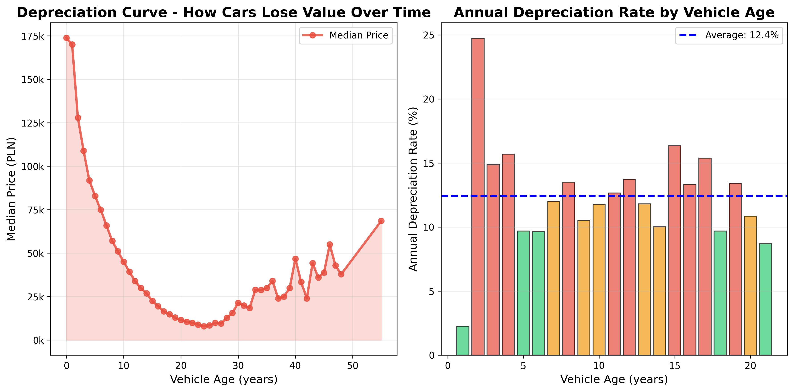

**Key Insights:**
- **Rapid early depreciation:** ~50% of value lost within the first 5 years — confirms the need for non-linear modeling
- **Stable decline:** Between 5–25 years, depreciation follows a consistent downward trend
- **Classic car effect:** Vehicles older than 25 years show price stabilization or slight increases (collectible/vintage transition)
- **Log transformation recommended** due to right-skewed price distribution and wide price range (thousands to millions of PLN)

---

#### Feature Relationships: Key Predictors vs Price

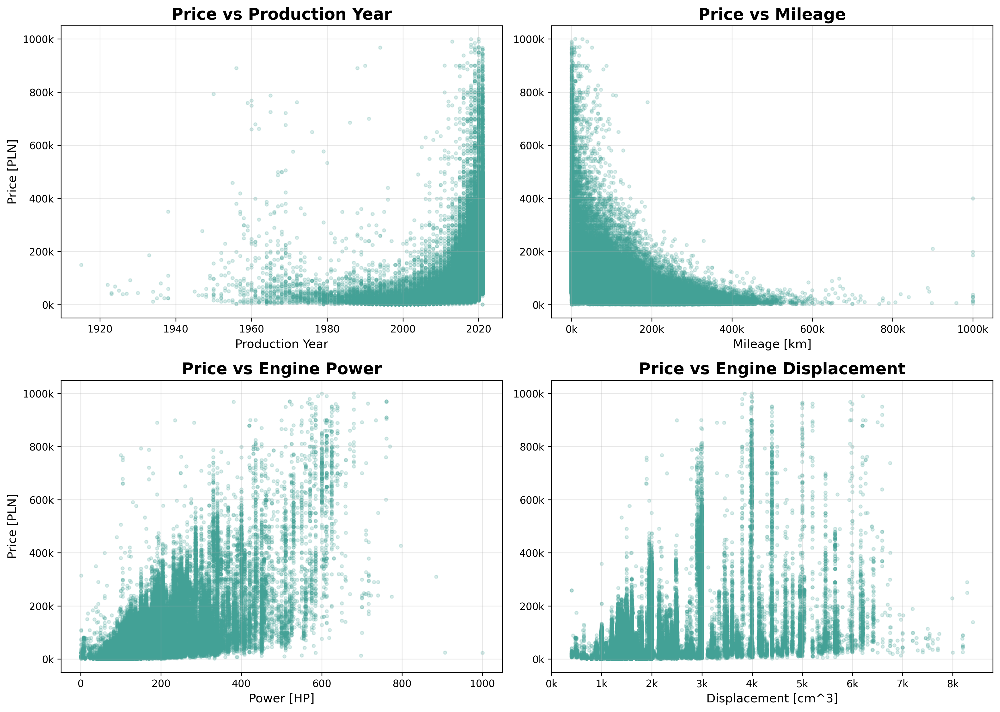

| Feature | Relationship | Key Finding |
|---------|-------------|-------------|
| Production Year | Strong positive | Sharp increase post-2015; 2020+ vehicles carry significant premium |
| Mileage | Strong negative | Lower mileage = higher price; most critical depreciation predictor |
| Power (HP) | Positive | Strongest numerical predictor; >500 HP shows extreme variance |
| Displacement (cm³) | Moderate positive | Less linear than HP; turbocharging reduces direct correlation |

**Modeling impact:** All four features are strong candidates for polynomial features and interaction terms, as their relationships with price are clearly non-linear.

---

#### Interaction Effects: Mileage × Age × Segment

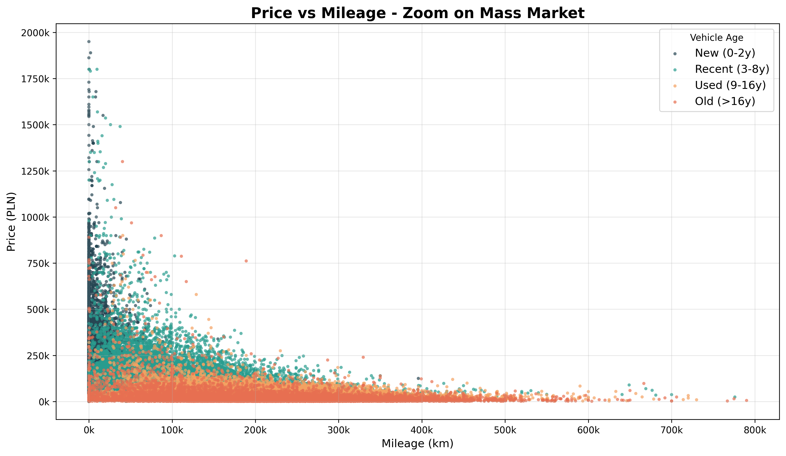

The combined effect of mileage and age on price varies significantly by vehicle segment — a key insight that motivated the creation of interaction features.

| Age Segment | Mileage Range | Price Range | Notes |
|-------------|--------------|-------------|-------|
| New (<3 years) | 0–20,000 km | 50k–1M PLN | Demo vehicles show slight mileage at premium |
| Recent (3–8 years) | <100,000 km | 50k–300k PLN | Premium brands retain value despite higher mileage |
| Used (9–16 years) | 50k–300k km | <200k PLN | Mass-market segment dominates |
| Old (>16 years) | up to 400k+ km | <50k PLN | Exceptions for vintage/collectible vehicles |

---

#### Fuel Type Price Evolution

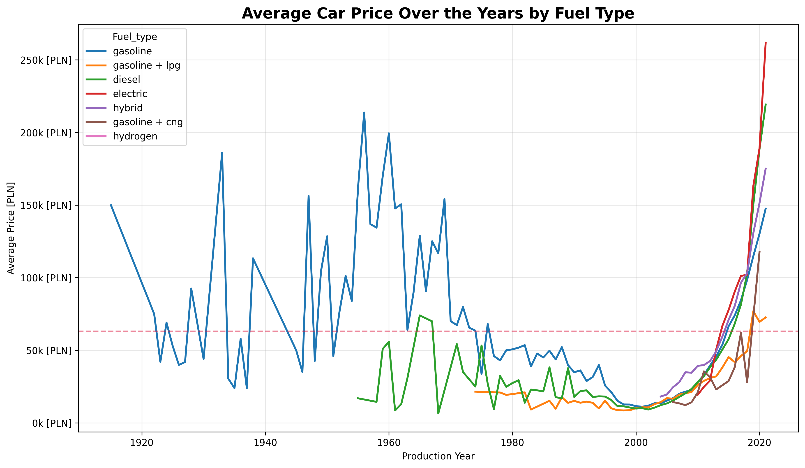

**Key Insights:**
- **Electric vehicles:** Sharp price increase post-2010 (battery costs, premium positioning)
- **Hybrid:** Moderate growth in mid-range segment
- **Diesel & Gasoline:** Steady historical increase
- **CNG & LPG:** Minimal growth (cost-sensitive segment)

Fuel type is also a strong proxy for vehicle era and segment, making it a valuable feature beyond just technical classification.

---

#### Correlation Analysis

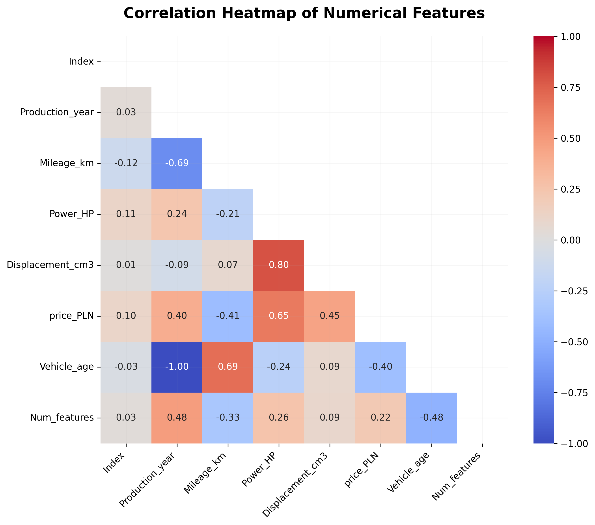

**Notable correlations with price:**
- `Power_HP`: **+0.58** — strongest numerical predictor
- `Production_year`: **+0.52** — newer = more expensive
- `Vehicle_age`: **-0.45** — older = cheaper (moderate due to vintage cars)
- `Displacement_cm3`: **+0.44** — engine size matters, but non-linearly

**Engineering decisions informed by this analysis:**
- `HP_per_liter` created to reduce `Power_HP` ↔ `Displacement_cm3` multicollinearity (r = 0.81)
- `Vehicle_age` used instead of `Production_year` (more interpretable, removes redundancy since correlation = -0.99)
- Polynomial and interaction terms added for moderate correlations to help the model capture non-linear patterns

---

### 🔧 Feature Engineering

Feature engineering was one of the most impactful stages of the project. The goal was to translate domain knowledge about the automotive market into features the model can learn from effectively.

#### Domain-Driven Feature Synthesis

| Feature | Type | Description |
|---------|------|-------------|
| `mileage_per_year`, `usage_intensity` | Operational | Distinguishes highway vs city usage patterns for same-age vehicles |
| `hp_per_liter` | Performance ratio | Captures modern turbo efficiency vs older naturally-aspirated engines |
| `is_premium`, `is_supercar` | Binary flags | Brand prestige and power thresholds — signals luxury pricing dynamics |
| `is_collector` | Binary flag | Vintage vehicles where rarity drives value more than utility |
| `age_category` | Segmentation | Lifecycle stages: New / Standard / Old / Vintage |

#### Non-Linear & Interaction Features

- **Polynomial terms:** Squared `vehicle_age`, `power_hp`, `mileage_km` — captures accelerating early depreciation that linear terms cannot represent
- **Interaction terms:** `age_mileage_interaction`, `power_age_interaction` — reflects how the combined effect of these variables differs across segments
- **Log transforms:** Applied to highly skewed features (`mileage_km`, `power_hp`, `displacement_cm3`) to stabilize variance and reduce outlier influence

#### Preprocessing Pipeline

```
ColumnTransformer
├── Numerical → Median imputation → StandardScaler
├── Low-cardinality categorical → OneHotEncoder
└── High-cardinality categorical → TargetEncoder (smoothing=500)
```

> All transformations are fitted **only on training data** and applied to the test set — no data leakage. The smoothing factor of 500 in TargetEncoder prevents overfitting to rare vehicle models with very few observations.

---

### 📈 Model Training & Performance

The modeling phase followed an incremental complexity approach — each step was motivated by the limitations of the previous model.

#### Model 1 — Linear Regression (Baseline)

| Metric | Value |
|--------|-------|
| R² | 83.1% |
| MAE | 14,798 PLN |
| RMSE | 34,358 PLN |
| MAPE | 29.3% |

Confirmed that car depreciation is **not a linear process**. Failed to capture accelerated early depreciation and brand premiums. Useful as a reference floor — every subsequent model is measured against this.

---

#### Model 2 — Random Forest

| Metric | Value |
|--------|-------|
| R² | 93.8% |
| MAE | 8,410 PLN |
| RMSE | 20,799 PLN |
| MAPE | 20.0% |

Introducing non-linear decision boundaries reduced MAE by ~50% vs baseline. Captured depreciation thresholds (e.g., crossing 100,000 km or 10 years of age) that linear regression missed entirely. Still struggled with luxury and vintage segments due to limited training examples in those categories.

---

#### Model 3 — XGBoost (Base) ⭐ Selected for deployment

| Metric | Train | Test |
|--------|-------|------|
| R² | 92.5% | 94.1% |
| RMSE | 24,494 PLN | 19,982 PLN |
| MAE | 6,711 PLN | 7,928 PLN |
| MAPE | 13.4% | 16.8% |

Best raw performance across all models. The slightly higher test R² compared to training R² suggests the test split contained proportionally fewer outliers (luxury/vintage vehicles). No signs of overfitting — training and test metrics are consistent.

##### XGBoost Feature Importance

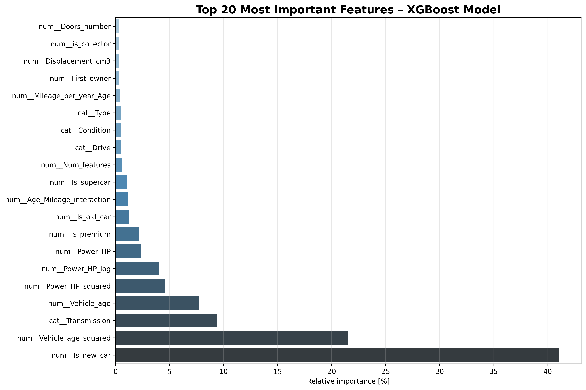

* **Primary Price Driver (Is_new_car)**: With a dominant importance score of 41%, the "new car" status is the single most critical predictor
* **Non-Linear Depreciation**: Age-related features (Vehicle_age_squared at 21% and Vehicle_age at 8%) account for nearly 30% of the model's logic.
* **Mechanical Configuration**: Transmission type (10%) and engine power (3–5%) represent the secondary tier of influence, proving that the technical powertrain setup is more impactful than auxiliary features like amenities or fuel type.

**Why XGBoost outperforms Random Forest here:**
- Sequential boosting focuses correction on residuals from previous trees — particularly effective for the diverse price range in this dataset
- More sensitive to the engineered interaction features
- Better handles the log-transformed target variable

---

#### Model 4 — XGBoost (Hyperparameter-Tuned via Optuna)

| Metric | Value |
|--------|-------|
| R² | 92.9% |
| MAE | 8,078 PLN |
| RMSE | 22,282 PLN |
| MAPE | 17.2% |

Added `Brand_frequency`, `Brand_category`, `Brand_popularity` features specifically to help the model handle niche, rare, and luxury vehicles. Applied strong regularization (Gamma, Alpha, Lambda) via 50+ Optuna trials. Despite the additional engineering effort, metrics decreased slightly vs the base model — the regularization overhead introduced more bias than the variance reduction justified.

##### SHAP Feature Importance

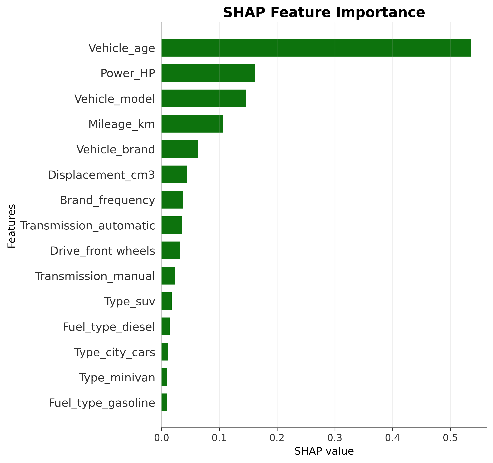

The most influential features align with real-world intuition:
- **Vehicle Age** (SHAP ≈ 0.55) — dominant predictor, consistent with the depreciation curve from EDA
- **Power (HP)** (SHAP ≈ 0.18) — reflects luxury and performance premium
- **Vehicle Model** (SHAP ≈ 0.15) — captures brand-specific pricing patterns not visible in aggregate statistics
- **Mileage (km)** (SHAP ≈ 0.12) — strong depreciation signal

Vehicle Type and Fuel Type contribute minimally (SHAP 0.01–0.03), confirming that technical performance metrics outweigh body style in price determination for this market.

**Decision: Base XGBoost (Model 3) selected** — best predictive accuracy with stable generalization. The tuned model's additional complexity did not translate to real-world performance gains on this dataset.

---

#### 🛠 Error Analysis

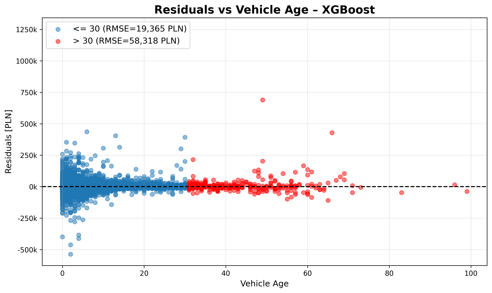

The largest prediction errors occur for:
- **Vintage vehicles** (pre-1980): RMSE ~59,301 PLN — ~3× higher than for newer cars. These vehicles are priced by rarity and collector demand rather than technical specs, which the model cannot fully capture from structured data alone.
- **Luxury & supercar segment** (Lamborghini, Aston Martin, Rolls-Royce): underrepresented in training data — fewer than 0.5% of all listings.

Mass-market vehicles (VW, Toyota, Opel, Škoda) remain well-predicted with low residuals. These niche segments were **intentionally retained** rather than removed — excluding them would artificially inflate metrics without improving real-world utility, and the application correctly warns users when a predicted vehicle falls into a high-uncertainty category.

---

#### 📊 Learning Curves

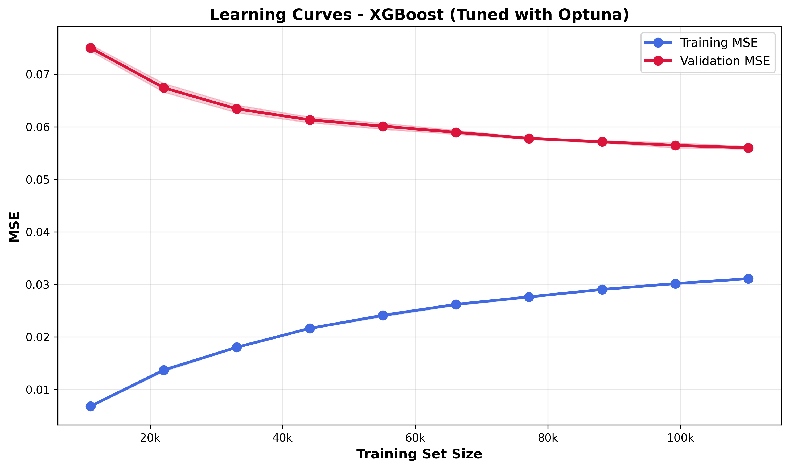

The learning curves confirm a healthy bias–variance balance:
- Training and validation curves converge smoothly — minimal overfitting
- Gap narrows as training set size increases — stable learning behavior
- A plateau is visible beyond ~150,000 samples — additional data alone is unlikely to substantially improve performance without new feature types (e.g., NLP from listing descriptions)

---

#### 🏁 Model Comparison

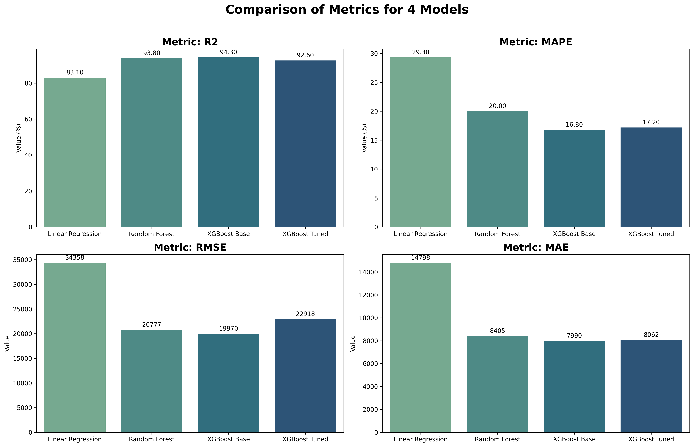

| Model | R² | MAE | MAPE | Decision |
|-------|----|-----|------|----------|
| Linear Regression | 83.1% | 14,798 PLN | 29.3% | ❌ Baseline only |
| Random Forest | 93.8% | 8,410 PLN | 20.0% | ✅ Strong but surpassed |
| **XGBoost Base** | **94.1%** | **7,928 PLN** | **16.8%** | ⭐ **Selected** |
| XGBoost Tuned | 92.9% | 8,078 PLN | 17.2% | ⚠️ Slightly worser results |

---

## ⚠️ Data Limitations & Inflation Adjustment

The dataset contains listings up to **2021**. To align predictions with current (2026) market prices, an **age-based inflation factor** is applied automatically in the application. A single flat factor was rejected in favor of segmented adjustment because different vehicle age groups experienced significantly different price dynamics during 2021–2026.

| Vehicle Age (as of 2021) | Factor | Rationale |
|--------------------------|--------|-----------|
| ≤ 3 years (2019–2021) | ×1.45 | Semiconductor crisis 2021–2023 drove near-new prices up 40–60% |
| 4–8 years (2013–2018) | ×1.37 | Most liquid segment; tracked standard market growth |
| 9–15 years (2006–2012) | ×1.25 | Budget segment; price-sensitive buyers dampened growth |
| 16–30 years (1991–2005) | ×1.15 | Niche market; lower demand elasticity, closer to CPI |
| >30 years (pre-1991) | ×1.05 | Collector market; independent pricing dynamics |

*Sources: autobaza.pl, Otomoto Market Report 2022, magazynauto.pl, NBP CPI data 2021–2026*

Additionally, the Otomoto search link shown after each prediction is adjusted by **+5 years** (2021→2026), so that the listings displayed reflect the **current equivalent age** of the predicted vehicle rather than the original production year. This allows users to directly cross-check the inflation-adjusted prediction against live market listings.

> **Production year cap:** The application limits predictions to vehicles manufactured up to 2021, as these are the only years present in the training data. Predictions for post-2021 vehicles would be extrapolations with no training support.

---

## 🚀 Deployment

- **Model Serialization:** Final model saved with `joblib.dump` and hosted on Hugging Face Hub for versioned storage and reproducibility.
- **Streamlit App:** Users input vehicle specs and receive real-time price predictions with inflation adjustment, vehicle summary stats, and a direct Otomoto search link.
- **Deployment:** Streamlit Community Cloud (live link at the top of this README).
- **Evaluation report:** Key metrics and model diagnostics saved as `reports/model_evaluation_report.txt`.

### Application Interface


The app contains four sections accessible via sidebar navigation:
- **Price Prediction** — main valuation tool with inflation-adjusted output and Otomoto link
- **Regional Market** — interactive map of listing distribution across Poland
- **Data Visualizations** — EDA charts with explanations
- **About Model** — model selection rationale, metrics, and limitations


---

### Example Prediction — Hyundai i20

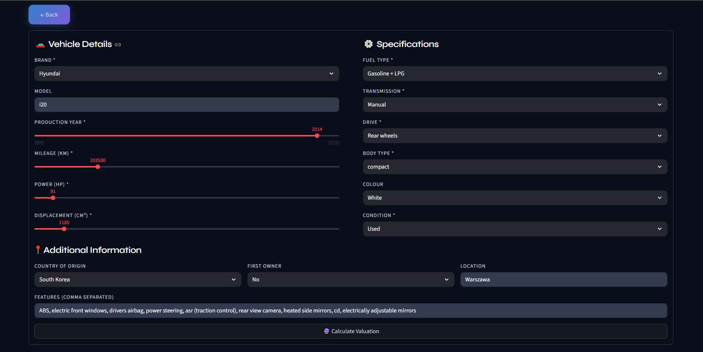

Comparable vehicles on the Polish market (similar year, mileage, power) typically sell between **30,000–40,000 PLN**. The model's prediction falls within this range, confirming strong performance for mass-market vehicles.

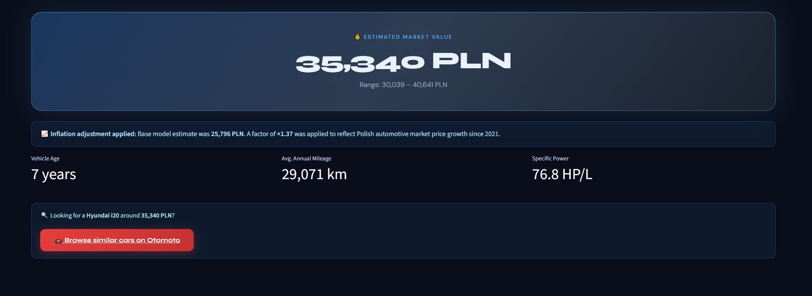

---

### Example Prediction — Mercedes-Benz C-Class

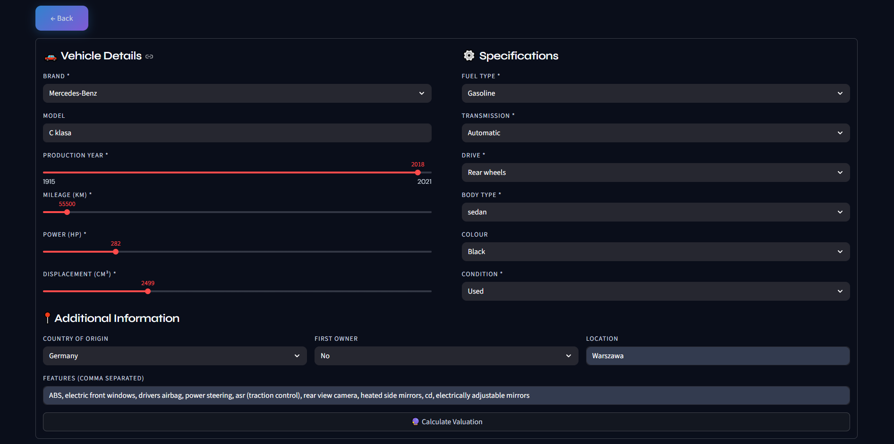

The model estimates approximately **132,000 PLN** — consistent with current Otomoto listings for comparable C-Class specifications from around 2023.

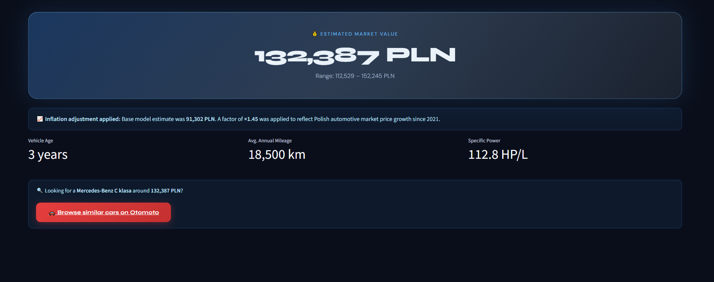

The Otomoto link is automatically generated with filters matching the predicted vehicle's adjusted year, mileage range, and price range — allowing users to immediately validate the prediction against real market listings.

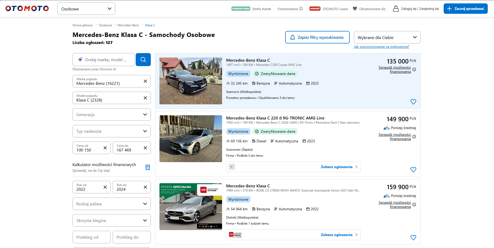

---

## 📊 Results & Business Impact

**Base XGBoost (Model 3)** was selected for deployment due to its best predictive accuracy and stable generalization across diverse vehicle segments.

| Improvement vs Baseline | Value |
|-------------------------|-------|
| MAE reduction | **45.5%** (14,798 → 7,928 PLN) |
| MAPE reduction | **42.7%** (29.3% → 16.8%) |
| R² improvement | +11.2 pp (83.1% → 94.3%) |

**Business applications:**
- **Dealership pricing:** Automated competitive price estimation at scale — reduces manual appraisal time
- **Inventory valuation:** Consistent, data-driven vehicle appraisal across large fleets
- **Depreciation forecasting:** Informs purchase timing and resale strategy decisions
- **Marketplace integration:** Architecture is REST API-ready for integration into listing platforms

---

## 🛠️ Tech Stack

| Category | Tools |
|----------|-------|
| ML & modeling | XGBoost, scikit-learn, category-encoders |
| Optimization | Optuna (Bayesian hyperparameter search) |
| Data processing | Pandas, NumPy |
| Visualization | Matplotlib, Seaborn, Plotly |
| Geospatial | Folium, streamlit-folium |
| Deployment | Streamlit, Hugging Face Hub |
| Serialization | Joblib |
| External APIs | NBP (currency conversion) |

---

## 📥 Installation & Usage

1. **Clone the repository:**
   ```bash
   git clone https://github.com/Przemsonn05/Car-Price-Prediction.git
   cd Car-Price-Prediction
   ```

2. **Install dependencies:**
   ```bash
   pip install -r requirements.txt
   ```

3. **Run the full pipeline (optional — model is pre-trained on Hugging Face):**
   ```bash
   python main.py
   ```

4. **Launch the Streamlit app:**
   ```bash
   streamlit run app.py
   ```

5. Inspect `notebooks/` for step-by-step experiment documentation and exploratory analysis.

---

## 🔮 Future Work

- **Up-to-date data:** Scrape current listings to retrain on post-2021 market data and eliminate the need for the inflation adjustment entirely.
- **NLP features:** Use Polish-language BERT to extract pricing signals from listing descriptions (e.g., detecting AMG packages, accident history mentions, special equipment).
- **Ensemble strategies:** Experiment with stacking XGBoost alongside LightGBM or CatBoost for potentially lower MAPE on outlier segments.
- **REST API:** Wrap the model in a FastAPI endpoint for integration into dealer platforms and automated listing tools.
- **Docker & CI/CD:** Containerize the application and add GitHub Actions for automated retraining when new data becomes available.

---

<div align="center">

**⭐ If you found this project helpful, please star the repository!**

[](https://github.com/Przemsonn05/Cars-Price-Prediction-in-Poland)

</div>